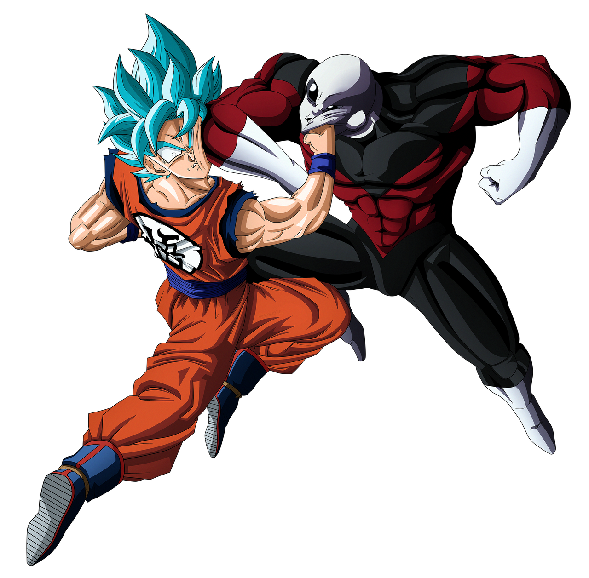

# Darkie Custom Traits Mod

An extensive custom trait and weapon overhaul for **Super Worldbox**, now updated to work with game version **0.50.5**.

---

## Overview

**Darkie Custom Traits Mod** adds over 30 unique traits, custom weapons, and special status effects. It introduces new mechanics, interactions, and chaotic storytelling elements that range from godlike abilities to cursed fates. Whether you're looking to summon beasts, cheat death, or suffer eternal torment, there's something here for you.

---

## Features

### Notable Traits

- Electro (NEW): Can use the power of electricity to electrocute their enemies and teleporting really fast on moving!

- Time Stopper (NEW): Will freeze enemies in time, or make them age faster and help unfreeze their allies in battle! Ultimate skill is wide spread time stop! 

- **The Tortured**  
  Eternal pain, hellfire, toxic air, and cursed immortality. Trapped in ice if not burning. Your children will inherit the suffering. Periodic meteor strikes and lightning storms target you and your loved ones. Regeneration ensures you live through it all. You are cast out from civilization. You are the forsaken. You're here forever.  
  *Updated: All loopholes closed. No terrain abuse, no cursed trait workarounds. You live, suffer, and remember why this was made for you.*

- **Mirror Man**  
  Reflects damage to attackers and creates a mirrored clone that gradually dies over time.

- **Vampire Lord**  
  Wields the teleport dagger. Can turn into a bat, summon bat allies, heal while transformed, and has a chance to convert or drive enemies mad.

- **The Dark Necromancer**  
  A more powerful and dangerous necromancer variant.

- **Reviver of Death**  
  Inspired by the Supertrait mod. Can turn zombies back into normal units. Thanks to Harp for fixing this.

- **Nullify**  
  Extremely dangerous. Can erase most traits. Do not provoke.

- **Power Mimicry**  
  Steals enemy traits, but risks losing them later.

- **Phoenix**  
  Revives once upon death.

- **Stuffed**  
  Never feels hungry. Great for students.

- **Insatiable Hunger**  
  Can eat endlessly—even an entire kingdom.

- **Dupli-Kate**  
  Clones herself to support the kingdom. All clones die if she dies.

- **Blood of Werewolf**  
  Transforms during moon age. Has special attack effects.

- **Esteemed Commander**  
  Increases army size and recruits peasants.

- **Ant Man**  
  Can shrink in size.

- **Titan Shifter**  
  Transforms into a Titan with animation. Stronger than the default titan.

- **Mage Magister**  
  Casts random spells on enemies during battle.

- **The Titan**  
  A powerful giant that knocks enemies back.

- **Wololo Unit**  
  Converts enemies to its side.

- **Wolf/Bear/Dragon Tamers**  
  Spawn tamed beasts to fight for their kingdom.

- **Gangster**  
  Summons a group to help with crowd control.

- **Hawkeye**  
  Enhanced accuracy.

- **Almighty**  
  Boosts all stats. Overpowered.

- **Berserker / Flash / Idiot Savant / Old Wise One / The Mountain / Medic Healer / Nightcrawler / Shield Guy / Thor Odinson / Turtle Guy**  
  Archetype-based traits with unique playstyles and strengths.

---

## Custom Weapons

- **Mjolnir (Thor's Hammer)**  
  Calls lightning down on multiple enemies. Only the worthy may wield it. Summoned automatically when Thor is low on health.

- **Ice Sword**  
  Deadly weapon with "Ice Storm" ability that freezes everything nearby.

- **Teleport Dagger**  
  Lets the user dash directly to enemies. Ultimate: area-of-effect blink strike.

- **Glass Sword**  
  Causes bleeding. Wielded by Mirror Man. Thanks to Agriche and Ahoyos for the slash effect from their One Piece mod.

---

## Installation

**Option 1: Manual**
1. Clone or download this repo as zip.
2. Extract content to the following folder:  
   `...\steamapps\common\worldbox\Mods\DarkieCustomTraits`
3. File `Main.cs` must be at `...\steamapps\common\worldbox\Mods\DarkieCustomTraits\Main.cs` for the mod to work.

**Option 2: NML One-Click Install**  
Install directly from GameBanana:  
[Darkie Custom Traits Mod](https://gamebanana.com/mods/434668)

---

## Credits

Special thanks to:  
**Dej, SALTY, Cody, Key, Tux**, and the entire **Super Worldbox modding community** for all the support and help in making this mod possible.  
Additional thanks to **Harp**, **Agriche**, and **Ahoyos** for contributions and inspiration.

---

## License

Feel free to play, modify, or extend this mod. Just give proper credit where it's due. Not for commercial use.

**
Copyright © Darkie 2025
**